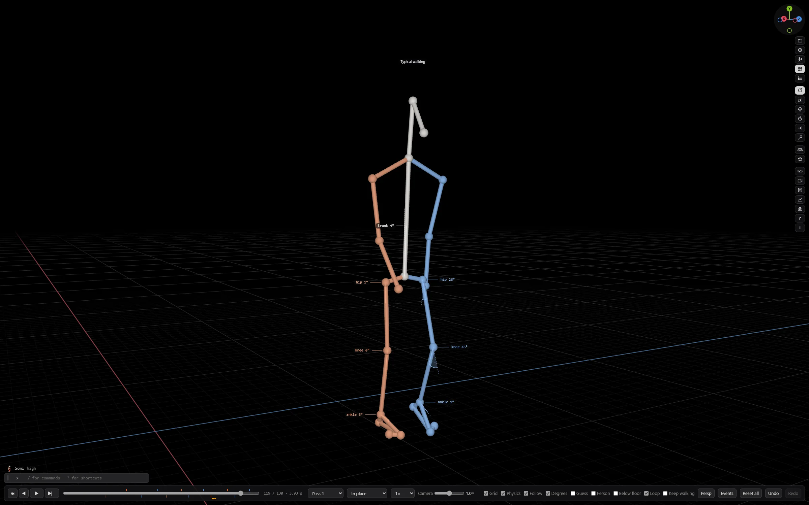

# Walkfigure

**Gait analysis from one phone video, on your own computer.** Free.

Walkfigure takes an ordinary video of someone walking past a phone. It finds the body's keypoints, measures the hip,
knee, ankle and trunk angles and the timing of every step, and shows the walk as a 3D figure you can turn, step through
frame by frame, and stand beside a typical walker. **The video is analysed on your computer. It is not uploaded.**



> Research software, in beta. **Not a medical device.** It does not diagnose, it does not recommend treatment, and its
> numbers are estimates to check against the video rather than measurements to rely on.

## Download

**[WalkfigureSetup.exe — latest release](https://github.com/mgambio/walkfigure/releases/latest/download/WalkfigureSetup.exe)**
· 407 MB · Windows 10 or 11, 64-bit

No account, no licence key, nothing held back. One setup file, installed for one Windows user, no administrator needed.
It downloads nothing while it installs.

### Before you run it

Walkfigure is **not code-signed**, so Windows will warn you the first time: a blue "Windows protected your PC" box.
That means Windows does not recognise the publisher — not that anything is wrong with the file. Choose **More info**,
then **Run anyway**.

To check the file first, compare its SHA-256. In PowerShell:

```powershell
Get-FileHash WalkfigureSetup.exe
```

| Version | SHA-256 |
|---|---|
| 1.1.66 | `233d50d26539dcc90e3c70f8d69c6f75d4bc43d095224e947557251dceabbd8d` |

## What it measures

- Hip, knee and ankle angles and the trunk's lean, on every frame, drawn as a wedge at the joint so the number can be
  checked by eye.
- Heel strikes and toe-offs, and where each leg is in its gait cycle. Correct one by hand and everything that rests on
  it follows.
- Cadence, stride time, stance and double support.
- Step length, toe clearance, heel rise, and how the foot lands.
- Every stride in a table, with mean ± SD, variability and left-to-right symmetry, stating how many strides each number
  rests on.
- Curves over the gait cycle, with typical walking behind them as a band.
- A **typical walker** to compare with: built to the person's own segment lengths, stepping in time with them, its
  joints following the mean curves of a published reference group (Lencioni et al. 2019, CC BY 4.0). It is a
  construction from a group's averages — not a person, and not a target.

Exports: a report as PDF or HTML with the caveats on its first page; CSV of every frame, of the strides and of the
summary; the motion as BVH; a clip or a snapshot of the view. There is also a local REST service on 127.0.0.1 for
other programs, with SDKs for Python and JavaScript.

## Somi

The box at the bottom left is Somi, an assistant that reads the numbers Walkfigure computed — the same ones the panels
show — explains them, and sets up the scene. It does not interpret measurements and does not advise about the person.

**Somi is the one thing that leaves your computer.** Its answers come from a language model run by a third party, so
what you ask it, and the gait numbers it reads to answer, are sent to that provider, who may keep them. If that is not
acceptable for the people you film, do not use Somi — everything else works without it.

## What it is not

- **One camera, one side.** Every angle is measured in the side view only. Depth is not measured: the figure is a flat
  tracing of that view, with its two sides pulled apart by fixed amounts.
- **Keypoints, not markers.** The angles come from keypoints a pose model finds in the picture. They are not a
  laboratory's marker angles and can differ by several degrees, most at the ankle.
- **Distances rest on a height.** Enter the real one where you know it. Every distance and speed depends on it; angles
  and timing do not.
- **A few strides.** A short video holds few, and averages from few are a rough guide.
- **In beta.** It is still changing, and it will be wrong sometimes. Check what it tells you against the video.

The physics sandbox and kids' mode are displays, not measurements. The sandbox says nothing about anyone's risk of
falling.

## Licence

Free to use, on any number of computers you control, under [LICENCE.txt](LICENCE.txt) — the same agreement setup shows
you on install. In short: use it, pass the unmodified installer on, don't sell it, don't strip the notices, and don't
present its output as a medical determination.

Walkfigure includes components written by others, each under its own licence; they are listed in `licenses\PACKAGES.md`
in your installation.

## Citing

Walkfigure's pose stage is a modified copy of [Sports2D](https://github.com/davidpagnon/Sports2D) (BSD 3-Clause). If you
publish work that used Walkfigure, please cite its authors:

> Pagnon, D. (2024). Sports2D. *Journal of Open Source Software*. doi:[10.21105/joss.06849](https://doi.org/10.21105/joss.06849)

The typical-walking reference curves are from Lencioni et al. (2019), CC BY 4.0.

---

From **MGAM** · [mgam.bio/walkfigure](https://mgam.bio/walkfigure) · contact@mgam.bio
